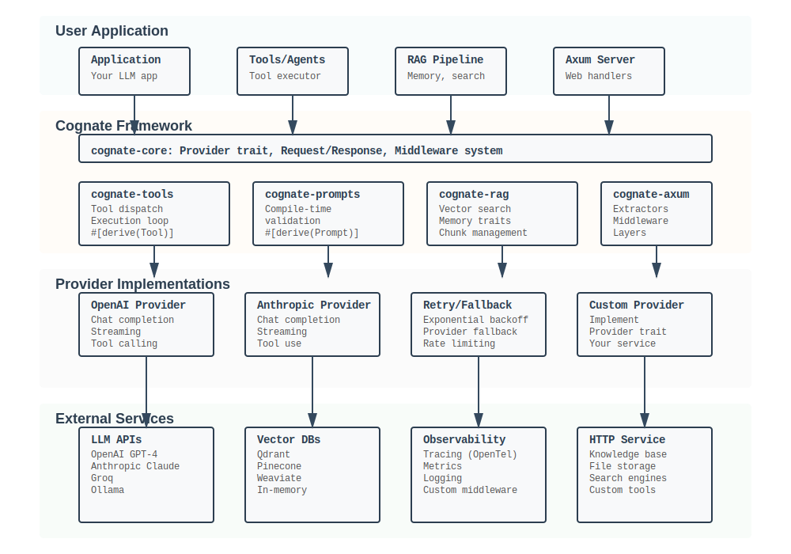

# Cognate Architecture

This document describes the design and architecture of Cognate, including crate organization, design patterns, and key concepts.

## Overview

Cognate is a modular LLM framework built on Rust's async ecosystem (tokio). It provides type-safe abstractions over multiple LLM providers while maintaining zero-cost abstractions and minimal overhead.



## Crate Organization

### Layer 1: Core Abstractions

#### cognate-core

The foundation. Defines:

- **Provider trait**: Object-safe trait for implementing LLM providers
- **Request/Response types**: Serializable request and response structures
- **Middleware system**: Layer-based middleware composition
- **Error handling**: Comprehensive error types

```rust
pub trait Provider: Send + Sync {
    async fn complete(&self, req: Request) -> Result<Response>;
    async fn stream(&self, req: Request) -> Result<BoxStream<Chunk>>;
}
```

Key exports:
- `Provider` - implement for new backends
- `Request`, `Response`, `Message` - core types
- `Middleware`, `Layer` - middleware composition
- `Error`, `Result` - error handling
- `TokenBucket` - rate limiting
- `MockProvider` - testing support

### Layer 2: Derive Macros

#### cognate-prompts-derive

Compile-time prompt template validation.

```rust
#[derive(Prompt)]
#[prompt(template = "You are a {role}. Answer: {question}")]
struct SystemPrompt {
    role: String,
    question: String,
}
```

- Validates template variables at compile time
- Generates `render()` method
- Detects typos in variable names

#### cognate-tools-derive

Type-safe tool definition and JSON schema generation.

```rust
#[derive(Tool)]
#[tool(description = "Add two numbers")]
struct Calculator {
    a: i32,
    b: i32,
}

impl Calculator {
    async fn run(&self) -> Result<String> { /* ... */ }
}
```

- Generates JSON Schema from struct
- Implements Tool trait
- Type-safe tool calling

### Layer 3: Features

#### cognate-providers

Concrete LLM provider implementations:

- **OpenAiProvider**: GPT-4, GPT-3.5, all OpenAI models
- **AnthropicProvider**: Claude 3 family
- **RetryConfig**: Exponential backoff retry logic
- **FallbackProvider**: Provider switching on error

Provider selection:

```
User Code
    |
cognate-providers (public API)
    |
    +-- OpenAiProvider -----> OpenAI API
    |       |
    |       +-- with_retry(RetryConfig)
    |       +-- with_timeout(Duration)
    |       +-- with_middleware(...)
    |
    +-- AnthropicProvider -> Anthropic API
    |
    +-- FallbackProvider --> Try primary, fall back to secondary
    |
    +-- CustomProvider trait implementation
```

#### cognate-tools

Tool dispatch and automatic execution:

- **Tool trait**: Implemented by #[derive(Tool)]
- **ToolExecutor**: Automatic tool-calling loop
- **Message parsing**: Extract tool calls from LLM responses
- **Result injection**: Feed tool results back to LLM

Execution loop:

```
User request with tools
    |
Provider.stream()
    |
    +-- Receives: "I'll use Calculator(a=5, b=3)"
    |
Executor.dispatch("Calculator", {"a": 5, "b": 3})
    |
    +-- Deserialize JSON -> Calculator { a: 5, b: 3 }
    +-- Call calculator.run()
    +-- Get result: "5 + 3 = 8"
    |
Send tool result back to LLM
    |
Provider.stream() again
    |
Final response delivered
```

#### cognate-prompts

Compile-time prompt validation and template system:

- **Prompt trait**: Rendering templates with variable substitution
- **Template validation**: Catch missing variables at compile time
- **Handlebars integration**: Rich template syntax

Template example:

```rust
#[derive(Prompt)]
#[prompt(template = r#"
You are a {role} with expertise in {domain}.
Previous context: {context}
User question: {question}
"#)]
struct ExpertPrompt {
    role: String,
    domain: String,
    context: String,
    question: String,
}

// Compile error if missing any field
let prompt = ExpertPrompt { /* ... */ };
```

#### cognate-rag

Retrieval-augmented generation primitives:

- **VectorStore trait**: Pluggable vector search implementations
- **InMemoryVectorStore**: Reference implementation
- **Embedding traits**: Abstract over embedding providers
- **ChunkMemory**: Chunk management and retrieval

Vector store abstraction:

```rust
pub trait VectorStore: Send + Sync {
    async fn add(&self, id: String, content: String) -> Result<()>;
    async fn search(&self, query: String, limit: usize) -> Result<Vec<Document>>;
    async fn delete(&self, id: String) -> Result<()>;
}
```

Implementations (pluggable):
- InMemoryVectorStore (reference, no persistence)
- Qdrant (production vector database)
- Pinecone (managed service)
- Weaviate (open-source)
- Custom implementations

#### cognate-axum

Web server integration for Axum framework:

- **Extractors**: Request extraction helpers
- **Middleware layers**: Common middleware (usage tracking, logging)
- **Response types**: Type-safe response serialization
- **Examples**: ChatGPT-like web server

Web integration:

```
HTTP Request
    |
Axum Router
    |
    +-- Extractor: Json<Request>
    |
cognate-axum middleware
    |
    +-- Usage tracking layer
    +-- Rate limiting layer
    +-- Logging/tracing layer
    |
Your handler: async fn chat(req: Request) -> Result<String>
    |
    +-- Create provider
    +-- Send request
    +-- Stream or return response
    |
HTTP Response (JSON)
```

#### cognate-cli

Command-line tools for development:

- **cognate init**: Project scaffolding
- **cognate test**: Test LLM integrations
- **cognate bench**: Benchmark providers

### Layer 4: User Application

Your Rust code using Cognate.

## Design Patterns

### Zero-Cost Abstractions

Cognate uses compile-time abstractions where possible:

- Proc-macros generate code at build time
- Trait objects only where necessary (Provider trait)
- Generic types for concrete implementations

Example: Tool schema generation happens at compile time, not runtime.

### Builder Pattern

Fluent API for configuration:

```rust
let provider = OpenAiProvider::new(api_key)?
    .with_timeout(Duration::from_secs(30))
    .with_retry(RetryConfig {
        max_retries: 3,
        initial_backoff: Duration::from_millis(100),
        max_backoff: Duration::from_secs(10),
    });
```

### Middleware/Layer Pattern

Composable request/response handling:

```rust
pub trait Middleware: Send + Sync {
    async fn process(&self, req: &mut Request) -> Result<()>;
}

pub trait Layer: Send + Sync {
    type Request;
    type Response;
    async fn call(&self, req: Self::Request) -> Result<Self::Response>;
}
```

Example middleware:
- Retry: Automatic retries with exponential backoff
- RateLimit: Token bucket rate limiting
- Tracing: OpenTelemetry integration
- UsageTracking: Token and cost accumulation

### Trait Objects for Flexibility

Provider trait is object-safe:

```rust
let provider: Box<dyn Provider> = Box::new(OpenAiProvider::new(key)?);

// Can be passed around, stored, swapped at runtime
async fn run_with_provider(p: &dyn Provider) -> Result<()> {
    let response = p.complete(request).await?;
    println!("{}", response.content());
    Ok(())
}
```

### Streaming Design

Responses are streamed by default:

```rust
pub async fn stream(&self, req: Request) -> Result<BoxStream<Chunk>> {
    // Returns async stream of chunks
    // Client consumes as: stream.next().await
}
```

Benefits:
- Immediate feedback (first token in <100ms)
- Reduced memory (don't buffer entire response)
- Better UX (progressive display)

## Data Flow

### Simple Completion

```
User Code
    |
Request::new()
    .with_model("gpt-4o-mini")
    .with_messages([...])
    |
provider.complete(request)
    |
OpenAiProvider
    |
    +-- Middleware: Retry layer
    |       +-- Check rate limit
    |       +-- Transform request
    |
    +-- HTTP POST to https://api.openai.com/v1/chat/completions
    |       +-- Serialize Request
    |       +-- Send with auth headers
    |       +-- Parse response JSON
    |
    +-- Middleware: Tracing layer
    |       +-- Log request/response
    |       +-- Record metrics
    |
    +-- Deserialize -> Response
    |
Return Response to user
    |
response.content()
```

### Tool Calling Flow

```
User Code
    |
Request with tools: [Calculator, WebSearch]
    |
provider.stream(request)
    |
OpenAI responds: "I'll use Calculator with a=5, b=3"
    |
ToolExecutor.dispatch()
    |
    +-- Parse LLM response for tool calls
    +-- Find matching tool (Calculator)
    +-- Deserialize args: {"a": 5, "b": 3}
    +-- Type check against Calculator struct
    +-- Call calculator.run()
    |
Get result: "8"
    |
Inject result back into conversation
    |
provider.stream() again (continues)
    |
Final response from LLM
    |
Return to user
```

### RAG Pipeline Flow

```
User question
    |
VectorStore.search(question, limit=5)
    |
    +-- Compute embedding of question
    +-- Find similar documents
    +-- Return top 5 matches
    |
Augment request with context:
    Message::system("Context from documents...")
    |
provider.complete(augmented_request)
    |
LLM responds with context-aware answer
    |
Return to user
```

## Extension Points

### Implement a Custom Provider

```rust
use cognate_core::{Provider, Request, Response};
use async_trait::async_trait;

struct MyProvider;

#[async_trait]
impl Provider for MyProvider {
    async fn complete(&self, req: Request) -> cognate_core::Result<Response> {
        // Your implementation
        todo!()
    }
    
    async fn stream(&self, req: Request) -> cognate_core::Result<BoxStream<Chunk>> {
        // Your streaming implementation
        todo!()
    }
}
```

### Implement a Custom VectorStore

```rust
use cognate_rag::VectorStore;

struct MyVectorStore {
    // Your storage backend
}

#[async_trait]
impl VectorStore for MyVectorStore {
    async fn add(&self, id: String, content: String) -> Result<()> {
        // Implement storage
        todo!()
    }
    
    async fn search(&self, query: String, limit: usize) -> Result<Vec<Document>> {
        // Implement search
        todo!()
    }
}
```

### Add Custom Middleware

```rust
use cognate_core::Middleware;

struct MyMiddleware;

#[async_trait]
impl Middleware for MyMiddleware {
    async fn process(&self, req: &mut Request) -> Result<()> {
        // Transform request, check limits, log, etc.
        println!("Processing request: {}", req.model());
        Ok(())
    }
}
```

## Dependencies

Cognate keeps dependencies minimal:

- **tokio**: Async runtime (required)
- **async-trait**: Async trait support
- **serde/serde_json**: Serialization
- **reqwest**: HTTP client
- **thiserror**: Error handling
- **tracing**: Observability
- **axum**: Web server (optional, cognate-axum only)
- **proc-macro2/quote/syn**: Macro generation
- **schemars**: JSON schema generation

No unnecessary dependencies on LLM frameworks or heavy libraries.

## Performance Considerations

### Latency

- Minimum overhead: <1ms per request
- Streaming: First token in ~50ms
- Tool calling: Add <1.5ms per cycle

### Memory

- Baseline: 12-15 MB
- Per-connection: <1 MB
- Buffering: Streaming minimizes buffer size

### Compile Time

- Full rebuild: 8-12 seconds
- Incremental: 1-2 seconds

## Testing Strategy

### MockProvider

Built-in testing support:

```rust
use cognate_core::MockProvider;

let mock = MockProvider::new()
    .queue_response(Response::text("Test response"));

let response = mock.complete(request).await?;
assert_eq!(response.content(), "Test response");
```

### Integration Tests

Real provider tests use environment variables:

```bash
OPENAI_API_KEY=sk-... cargo test --features integration
```

## Roadmap

Short term (v0.2):
- Streaming cost estimation
- Additional provider integrations (Groq, LLaMA)
- Advanced caching

Medium term (v0.3):
- Web dashboard for monitoring
- Multi-turn conversation state management
- Built-in evaluation framework

Long term:
- WASM support
- Distributed caching layer
- Provider recommendation engine (cost optimization)
