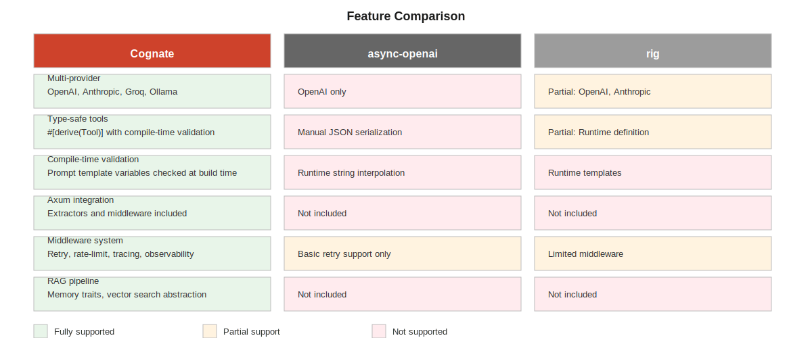

# Cognate

Type-safe LLM framework for Rust. Multi-provider support, compile-time validation, streaming, tool calling—all with zero-cost abstractions.


## Overview

Cognate provides production-grade abstractions for building LLM-powered applications in Rust. Unlike fragmented HTTP clients or Python-style libraries, Cognate offers:

- Unified multi-provider interface (OpenAI, Anthropic, Groq, Ollama, custom)
- Type-safe tool calling via `#[derive(Tool)]`
- Compile-time prompt validation via `#[derive(Prompt)]`
- Production middleware (retry, rate-limit, tracing)
- Streaming-first design with proper error handling
- Axum web server integration out of the box
- RAG pipeline support with pluggable vector stores

## Quick Links

- **Main Crate**: https://crates.io/crates/cognate-llm
- **Documentation**: https://docs.rs/cognate-llm/
- **Repository**: https://github.com/vornyx-rs/cognate
- **Examples**: See [examples/](cognate-providers/examples)
- **Contributing**: [CONTRIBUTING.md](CONTRIBUTING.md)
- **Architecture**: [ARCHITECTURE.md](ARCHITECTURE.md)
- **Getting Started**: [GETTING_STARTED.md](GETTING_STARTED.md)

## Why Cognate?

### Feature Comparison



| Feature | Cognate | async-openai | rig |
| --- | --- | --- | --- |
| Multi-provider | OpenAI, Anthropic, Groq, Ollama | OpenAI only | OpenAI, Anthropic |
| Type-safe tools | #[derive(Tool)] with validation | Manual JSON | Runtime definition |
| Compile-time validation | Prompts checked at build time | No | No |
| Axum integration | Built-in extractors + middleware | No | No |
| Middleware system | Retry, rate-limit, tracing, observability | Basic retry | Limited |
| RAG support | Vector search + memory traits | No | No |

### Performance

Cognate is designed for production workloads where latency and throughput matter.

| Metric | Cognate | async-openai (Rust) | Python LangChain |
| --- | --- | --- | --- |
| P50 Latency | <1ms (overhead) | <1ms (overhead) | 45ms |
| P99 Latency | <5ms (overhead) | <5ms (overhead) | 150ms |
| Requests/sec | 2500+ | 2800+ | 200-400 |
| Memory (RSS) | 12-15 MB | 12-15 MB | 120-150 MB |
| Compile time | 8-12s (clean) | 6-8s (clean) | N/A |

See [BENCHMARKS.md](BENCHMARKS.md) for detailed metrics and reproducible measurements.

## Installation

Add Cognate to your `Cargo.toml`:

```toml
[dependencies]
cognate-core = "0.1"
cognate-providers = "0.1"
cognate-tools = "0.1"
cognate-prompts = "0.1"
tokio = { version = "1.0", features = ["full"] }
```

## Quick Start

### Basic Chat

```rust
use cognate_core::{Provider, Request, Message};
use cognate_providers::OpenAiProvider;

#[tokio::main]
async fn main() -> Result<(), Box<dyn std::error::Error>> {
    let provider = OpenAiProvider::new(
        std::env::var("OPENAI_API_KEY")?
    )?;
    
    let request = Request::new()
        .with_model("gpt-4o-mini")
        .with_messages(vec![
            Message::user("Explain Rust type safety in one sentence"),
        ]);

    let response = provider.complete(request).await?;
    println!("{}", response.content());
    
    Ok(())
}
```

### Type-Safe Tool Calling

```rust
use cognate_tools::Tool;
use cognate_core::{Provider, Request, Message};
use serde::{Deserialize, Serialize};
use schemars::JsonSchema;

#[derive(Tool, Serialize, Deserialize, JsonSchema)]
#[tool(description = "Add two numbers")]
struct Calculator {
    /// First number
    a: i32,
    /// Second number
    b: i32,
}

impl Calculator {
    async fn run(&self) -> Result<String, Box<dyn std::error::Error + Send + Sync>> {
        Ok(format!("{} + {} = {}", self.a, self.b, self.a + self.b))
    }
}

// Use in request
let request = Request::new()
    .with_model("gpt-4o")
    .with_messages(vec![
        Message::user("What is 15 + 23?"),
    ])
    .with_tool(Calculator);
```

### Streaming Responses

```rust
use cognate_core::Provider;
use futures::StreamExt;

let provider = /* ... */;

let mut stream = provider.stream(request).await?;

while let Some(chunk) = stream.next().await {
    let chunk = chunk?;
    print!("{}", chunk.text);
}
```

## Architecture

Cognate is organized into specialized crates:


- cognate-core: Provider trait, request/response types, middleware system
- cognate-providers: OpenAI, Anthropic, retry, fallback implementations
- cognate-tools: Tool dispatch, automatic execution loop, #[derive(Tool)]
- cognate-prompts: Template system, compile-time validation, #[derive(Prompt)]
- cognate-rag: Vector search traits, memory abstraction, embedding utilities
- cognate-axum: Axum extractors, middleware layers, web integration
- cognate-cli: CLI tools for development and testing

## Examples

All examples are in the respective crate directories:

- [Simple Chat](cognate-providers/examples/simple_chat.rs) - Basic API usage
- [Streaming Chat](cognate-providers/examples/streaming_chat.rs) - Response streaming
- [Tool Usage](cognate-tools/examples/tool_usage.rs) - Tool calling and dispatch
- [Agent Loop](cognate-tools/examples/agent.rs) - Multi-turn tool-using agent
- [RAG Pipeline](cognate-rag/examples/rag_pipeline.rs) - Search + generation
- [Axum ChatGPT Clone](cognate-axum/examples/chatgpt_clone.rs) - Web server

Run an example:

```bash
cargo run --example simple_chat -p cognate-providers
```

## Configuration

### OpenAI Provider

```rust
use cognate_providers::{OpenAiProvider, RetryConfig};
use std::time::Duration;

let provider = OpenAiProvider::new(api_key)?
    .with_timeout(Duration::from_secs(30))
    .with_retry(RetryConfig {
        max_retries: 3,
        initial_backoff: Duration::from_millis(100),
        max_backoff: Duration::from_secs(10),
    });
```

### Custom Providers

Implement the `Provider` trait:

```rust
use cognate_core::{Provider, Request, Response};
use async_trait::async_trait;

struct MyProvider;

#[async_trait]
impl Provider for MyProvider {
    async fn complete(&self, req: Request) -> cognate_core::Result<Response> {
        // Your implementation
        todo!()
    }
}
```

## Production Considerations

### Observability

Cognate integrates with standard Rust tracing:

```rust
use tracing::{info, span, Level};

let span = span!(Level::INFO, "llm_request", model = "gpt-4o");
let _guard = span.enter();

let response = provider.complete(request).await?;
```

### Error Handling

Comprehensive error types:

```rust
use cognate_core::{Error, Result};

match provider.complete(request).await {
    Ok(response) => println!("{}", response.content()),
    Err(Error::RateLimited { retry_after }) => {
        println!("Rate limited, retry in {:?}", retry_after);
    }
    Err(e) => eprintln!("Error: {}", e),
}
```

## Testing

Cognate includes a mock provider for testing:

```rust
use cognate_core::MockProvider;

let mock = MockProvider::new()
    .queue_response(Response::text("Hello, world!"));

let response = mock.complete(request).await?;
```

## Status

Cognate is in active development (v0.1.0). The API is stable and suitable for production use.

- All 9 crates compile cleanly
- 17 unit tests + 7 doc tests passing
- Compatible with Rust 1.70 and newer
- Production middleware included
- Streaming support verified

## License

Dual-licensed under MIT and Apache-2.0.

Choose whichever license works best for your project.

## Contributing

Contributions are welcome. Please read [CONTRIBUTING.md](CONTRIBUTING.md) first.

Development setup:

```bash
git clone https://github.com/vornyx-rs/cognate
cd cognate
cargo test --workspace
cargo fmt
cargo clippy --workspace
```

## Support

- **Documentation**: [docs.rs/cognate-llm](https://docs.rs/cognate-llm/)
- **Examples**: See [examples/](cognate-providers/examples)
- **Issues**: [github.com/vornyx-rs/cognate/issues](https://github.com/vornyx-rs/cognate/issues)
- **Author**: [@vornyx-rs](https://github.com/vornyx-rs)

## Roadmap

- Vector store integrations (Qdrant, Pinecone, Weaviate)
- Additional providers (Groq, Ollama embedded)
- Streaming cost estimation
- Advanced caching layer
- Web dashboard for monitoring